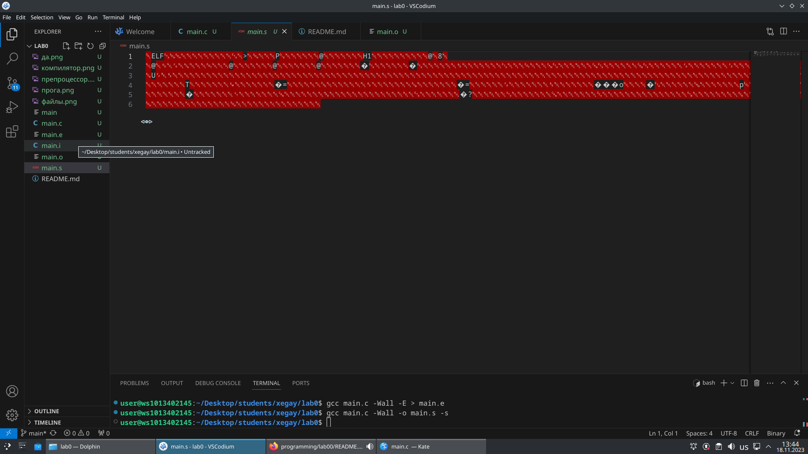

# Лабораторная работа №0
## задания
1. Создайте репозиторий для дисциплины на GitHub.
2. Склонируйте его себе на ПК.
3. Напишите свою первую программу.
4. Скомпилируйте и запустите её.
5. Получите по отдельности результаты каждого этапа компиляции.
6. Напишите отчёт в README.md. Отчёт должен содержать:
    * Задание
    * Описание проделанной работы
    * Консольные команды
    * Скриншоты результатов
    * Ссылки на используемые материалы
    * Сделайте коммит и пуш.
    * Добавьте для себя в отчёт шпаргалку по работе с git.

## ход работы

### 1. создайте репозиторий на git.hub
ссылка на репозиторий:
 https://github.com/Kakishbolshoy/1

### 2.склонируйте его себе на пк
```shell
git clone https://github.com/Kakishbolshoy/1.git
```
### 3.напишите свою первую программу
```
#include <stdio.h>
int main()
{
    printf("Hello, world\n");
    return 0;
}
```
### 4.скомпилируйте и запустите ее

### 5.получите по отдельности этапы компиляции



### 6.это и есть отчет


